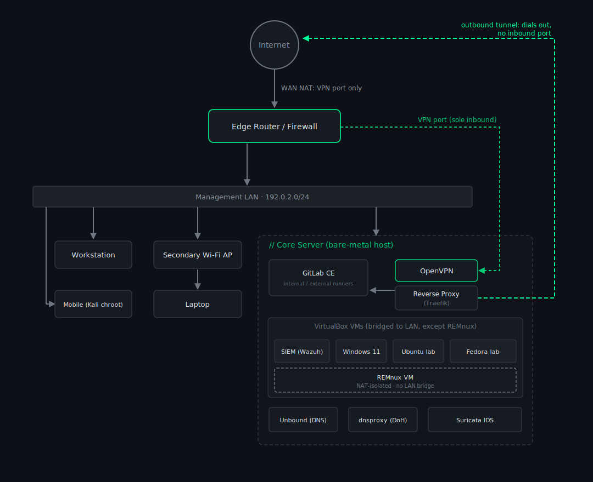

# Network

Addresses use RFC 5737 documentation ranges and generic role names - they
show the structure, not the real allocations.

## Segments

Trust is split across segments that match how exposed each is.

| Segment | Example range | Holds | Trust |
|---|---|---|---|
| Management LAN | `192.0.2.0/24` | Core server, workstation, laptops, **and the VMs (bridged)** | Highest (wired, local) |
| VPN clients | `198.51.100.0/24` | Authenticated remote devices | Medium (remote, authed) |
| Docker bridges | `203.0.113.0/24` | Per-tier isolated container networks on the core server | Scoped per tier |

Docker bridges are isolated per platform tier rather than sharing one flat
network, so a container in the app tier cannot reach the Git/CI tier laterally.

<figure class="diagram">
  
  <figcaption>// network topology - abstracted (example addresses, role names)</figcaption>
</figure>

## Why it's shaped this way

**Nothing inbound - by rule, from day one.** "Nothing inbound" was a design rule
before it was ever an implementation. The usual advice is to forward a port and
firewall it down; my answer is, why not just leave port 22 open to the internet
while you are at it? A forwarded-and-hardened port is still a port on the public
internet waiting to be wrong. The whole shape of the network falls out of
refusing that - one VPN port in, and public services that *dial out* over a
tunnel instead of opening anything.

**Self-hosted DNS, on purpose.** The easy path is to point everything at the
router or at `1.1.1.1` and forget it. I run my own resolver for two reasons:
learning (DNS is foundational, and you only understand it by operating it), and
not handing my ISP a log of everywhere I go - which is what the DoH layer is for.

## At a glance

- **Ingress:** one inbound port (the VPN); everything public reaches the world
  through an outbound-only tunnel, so there is **zero inbound surface**.
- **TLS:** a single wildcard certificate, auto-renewed with a DNS-01 challenge
  and fanned out to every consumer - no per-service ACME client.
- **DNS:** self-hosted Unbound (recursive, blocklisting) with a DoH frontend,
  pinned to loopback aliases so resolution survives reboots and link changes.
- **Resilience:** if the core's resolver goes down, the edge router automatically
  fails LAN DNS over to public resolvers and reverts when it recovers - so the
  LAN keeps internet even with the core offline.
- **Monitoring:** host, network, and perimeter telemetry all fan into the SIEM.

[Full mechanics - ingress paths, cert fan-out, egress control, DNS layers, and the gotchas &rarr;](network-deep-dive.md)
